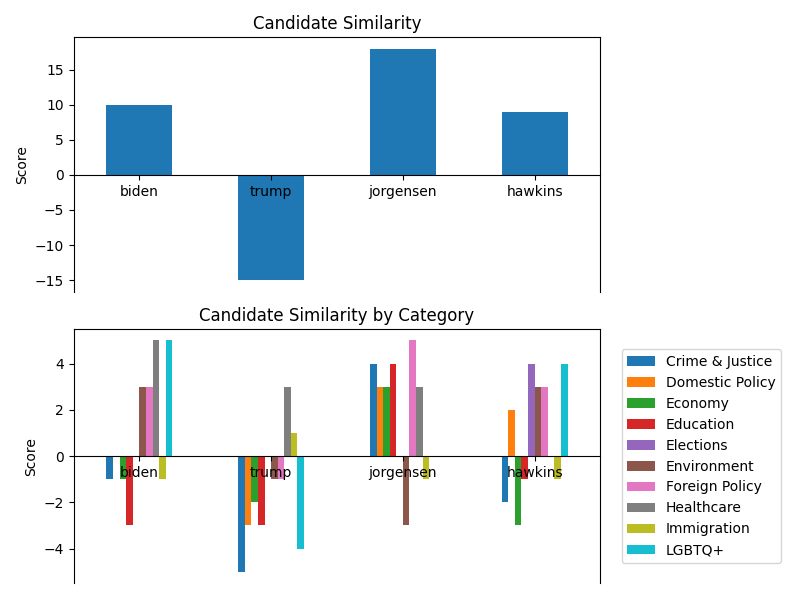

# prez_issues

Plot similarity to presidential candidates on various policies.

## Quickstart

    git clone http://github.com/evidlo/prez_issues && cd prez_issues
    pip --user install -r requirements.txt

    # answer all 72 questions
    python quiz.py

    # plot results
    python plot.py
    
## Algorithm

Scores are weighted by importance and summed

    score = sum(user_answer * candidate_answer * user_importance)
